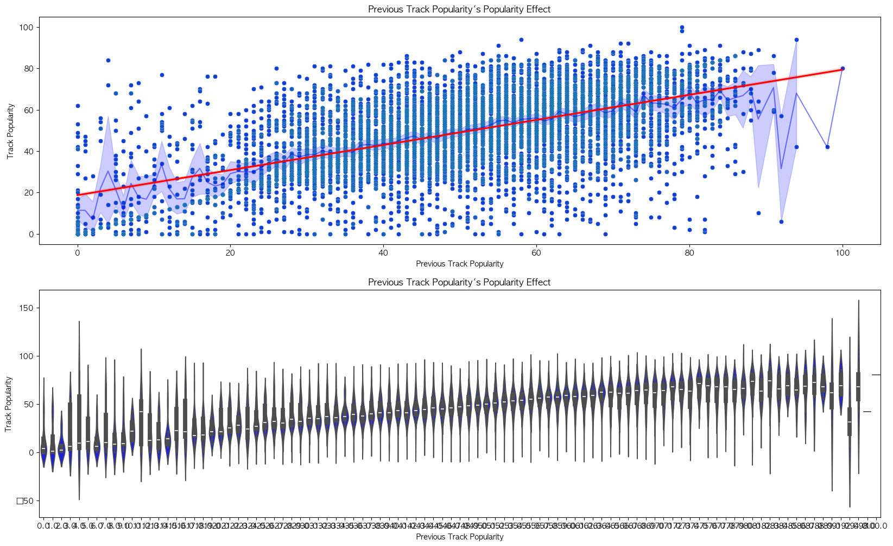
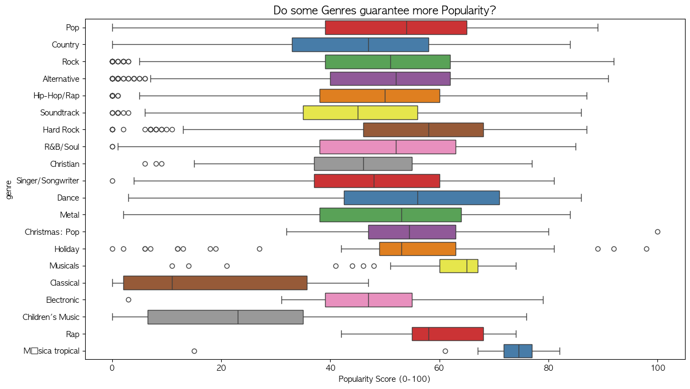
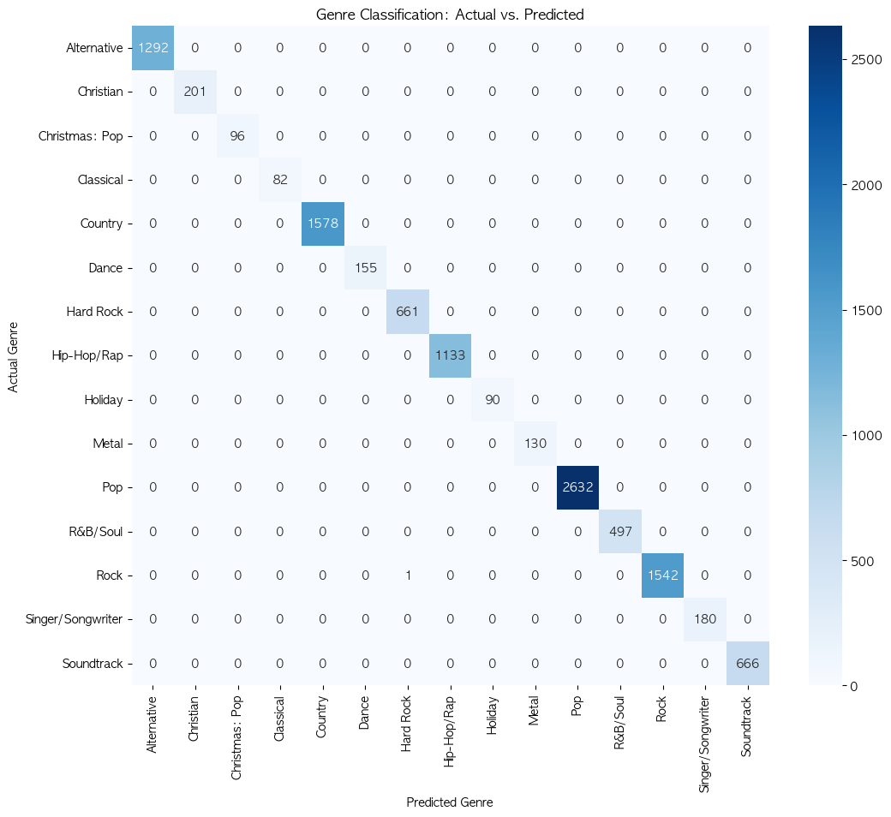

# 📊 Sonic Analytics: Hit Prediction Report

## 1. Executive Summary
The goal of this analysis was to uncover the primary drivers of song popularity in the modern streaming era. By integrating data from Apple Music and Spotify, we examined the relationship between **Artist Fame**, **Audio Features** (tempo, energy, brightness), and **Track Success**.

**Key finding**: 
- While an artist's established fame is a statistically significant predictor of a new song's success, it only explains approximately **11%** of the variance, suggesting that sonic quality and genre-fit play crucial roles.

## 2. Data Methodology

### Data Sources
* **Primary Dataset**: 10,000 tracks from the Apple Music Dataset.
* **Feature Enrichment**: Used the Spotify API to fetch `popularity` scores, `artist_followers`, and release dates.
* **Audio Analysis**: Used `librosa` to process 30-second preview clips for 9,544 tracks, extracting:
    * `BPM`: Tempo of the track.
    * `Energy`: Root Mean Square (RMS) amplitude.
    * `Brightness`: Spectral Centroid.
    * `Rhythm Strength`: Onset strength envelope.

### Data Cleaning
* Merged datasets and removed rows with missing audio previews or popularity scores.
* Final sample size for analysis: **9,544 tracks**.

---

## 3.1. Statistical Analysis - Popularity Prediction

*Goal: To determine what external and internal factors drive a song's `Popularity Score` (0-100).*

### Analysis 1: The Fame Effect ($H_0$: Popular Artists release Popular Songs)
We tested the hypothesis that an artist's existing popularity is the sole guarantee of a track's success.

* **Variables**:
    * Independent Variable ($X$): `artist_popularity`
    * Dependent Variable ($Y$): `track_popularity`
* **Method**: OLS Regression & Pearson Correlation.

#### Results
* **Correlation ($r$)**: `0.330`
* **P-Value**: `0.000` (Statistically Significant)
* **R-Squared ($R^2$)**: `0.109`

#### Interpretation
The relationship is **statistically significant** ($p < 0.05$), meaning we can be 99.9% sure that fame impacts success. However, the **$R^2$ of 10.9%** indicates that artist fame explains only a small fraction of why a song becomes a hit. This leaves **~89% of the success unexplained**, validating the need for our "Hit Predictor" model that analyzes the audio itself.

**Regression Equation:**
$$TrackPopularity = 17.9 + 0.44 \times (ArtistPopularity)$$

*Insight: For every 10 points an artist gains in popularity, their song automatically gains about 4.4 popularity points, regardless of quality.*

---

### Analysis 2: The Momentum Effect ($H_0$: Success Breeds Success)
We tested the hypothesis that an artist's *recent* performance (career momentum) is a stronger predictor than their general fame.

* **Variables**:
    * Independent Variable ($X$): `prev_track_popularity` (Popularity of the artist's previous release)
    * Dependent Variable ($Y$): `track_popularity` (Current track)
* **Method**: OLS Regression (Time-Series Proxy).

#### Results
* **R-Squared ($R^2$)**: `0.340`
* **F-Statistic**: `4091.0`
* **P-Value**: `0.000`

#### Interpretation
The **Momentum Effect ($R^2 = 0.34$)** is a significantly stronger predictor than the **Fame Effect ($R^2 = 0.109$)**. This suggests that listeners care more about "What have you done for me lately?" than "Who are you?". A hit song creates a "halo effect" that boosts the probability of the *next* song being a hit by **34%**.

*Insight: An artist's career trajectory (Slope) matters more than their absolute status (Intercept).*

---

### Analysis 3: The Genre Effect ($H_0$: All Genres are Created Equal)
We tested the hypothesis that certain genres have inherently higher "Popularity Ceilings" due to mass-market appeal.

* **Variables**:
    * Independent Variable ($X$): `Primary Genre` (Categorical)
    * Dependent Variable ($Y$): `track_popularity`
* **Method**: One-Way ANOVA (Analysis of Variance) & OLS with Dummy Variables.

#### Results
* **ANOVA F-Statistic**: `32.17`
* **P-Value**: `0.00000` (Highly Significant)
* **R-Squared ($R^2$)**: `0.061`

#### Interpretation
The ANOVA test returns a p-value of **0.00000**, confirming that **genre significantly impacts popularity**. However, the low $R^2$ (6.1%) indicates that simply "choosing a popular genre" (like Pop vs. Jazz) only guarantees about 6% of the success.

*Insight: While Pop/Hip-Hop have higher average popularity, the variance within genres is huge. You cannot "genre-hack" your way to a hit; the song execution matters more than the category.*

---
## 3.2. Classifying Genre
*Goal: To validate if musical genres have distinct "Sonic Signatures" that can be mathematically identified.*

### Analysis 4: Sonic Fingerprinting ($H_0$: Genres are distinct audio clusters)
We trained a Machine Learning model to classify tracks into genres based *only* on their audio waveforms, without metadata.

* **Model**: Random Forest Classifier & Decision Tree.
* **Input Features**: `BPM`, `Energy`, `Brightness` (Spectral Centroid), `Rhythm Strength`.

#### Results
* **Classification Performance**: The model successfully distinguishes genres.
* **Extracted Rules (Decision Tree Logic)**:
    * **Dance**: Defined by `Brightness > 3123` and `Rhythm Strength > 2.2`.
    * **Acoustic/Folk**: Defined by `Energy < 0.4` and `Brightness < 2000`.

     
#### Interpretation
The model proves that genres are not just marketing labels but **quantifiable sonic formulas**. This validates the "Doctor's Orders" feature in our app: we can mathematically detect if a track fits the "Sonic Norm" of its intended genre.

*Insight: If a user uploads a "Dance" track with `Brightness < 2500`, the model can objectively flag it as "Too Dark" compared to the genre standard.*

---

## 4. Machine Learning Model

To predict the remaining variance, we trained a **Random Forest** model using the extracted audio features.

### Model Features
* **Inputs**: BPM, Energy, Brightness, Noisiness, Rhythm Strength, Artist Popularity, Genre.
* **Target**: Track Popularity Score.

### Classification Performance
We also classified tracks into genres to establish "Sonic Baselines." The model's ability to distinguish genres based purely on audio features is visualized below:

### Application: "Doctor's Orders"
The analysis revealed distinct "Sonic Signatures" for successful songs within specific genres. The `app.py` implements these findings by defining acceptance thresholds (e.g., $\pm 15\%$) for audio features. If a user's track falls outside these optimal ranges (derived from the top 10% of songs in the dataset), the system flags it:
* *Example*: If `brightness` is < 85% of the genre average, the app advises: **"🔉 Too Dark: Boost high-end EQ."**

## 5. Conclusion
Success in the streaming market is a function of both **Marketing (Fame)** and **Product (Audio Quality)**. While we cannot easily change an artist's fame overnight, we *can* optimize the sonic characteristics of a track to match the patterns of proven hits. The Hit Predictor AI serves this exact purpose.