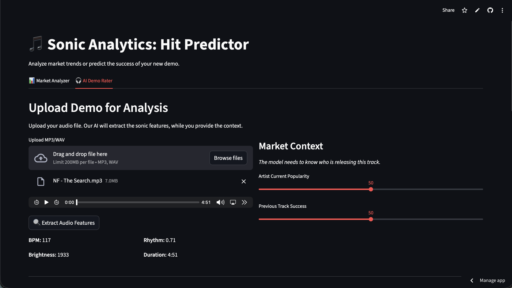
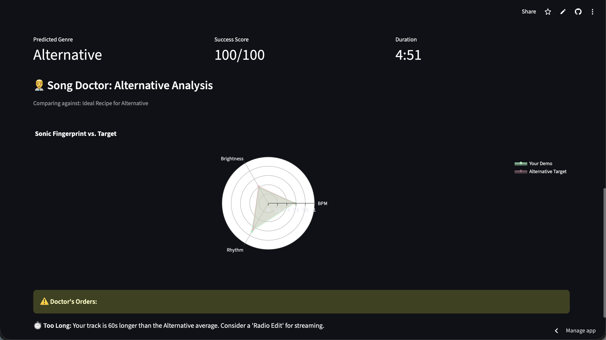
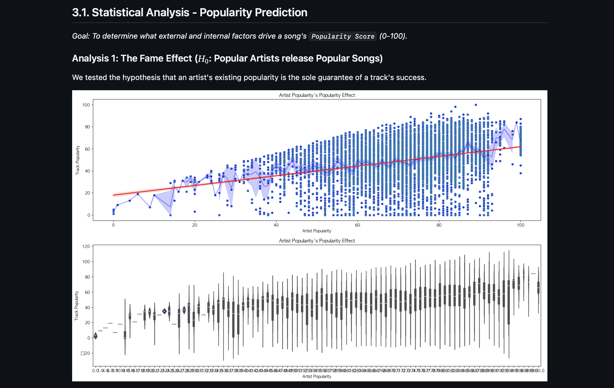

# 🎵 Hit Predictor AI: Sonic Analytics

**Hit Predictor AI** is a data-driven application designed to assist music producers and artists in evaluating the potential popularity of their tracks. By analyzing audio features and artist metrics, the app predicts a "Popularity Score" and provides actionable feedback ("Doctor's Orders") to help optimize tracks for commercial success.

🔗 **Check it out [HERE](https://sonic-analytics-hit-predictor.streamlit.app)**

<h2>📊 Market Analyzer</h2>
<p align="center">
  
</p>

<hr>

<h2>👩‍⚕️ Song Doctor</h2>

<table>
  <tr>
    <td width="50%" align="center">
      
    </td>
    <td width="50%" align="center">
      
    </td>
  </tr>
</table>


## 🚀 Features

* **Hit Prediction Engine**: Uses a Machine Learning model (Random Forest) to predict a song's popularity score (0-100) based on audio features and artist fame.
* **Audio Analysis**: Automatically extracts key sonic features from audio files using `librosa`:
    * **BPM (Tempo)**
    * **Energy (RMS)**
    * **Brightness (Spectral Centroid)**
    * **Rhythm Strength**
* **"Doctor's Orders" ⚠️**: Provides specific, data-backed advice if your track deviates from the sonic norms of successful songs in your genre (e.g., "Your track is too dark," or "Rhythm is too aggressive").
* **Visualizations**: Interactive charts to compare your track against genre averages.

## 📂 Project Structure

```bash
├── app.py                 # Main Streamlit application
├── analysis.ipynb         # Data analysis, feature extraction, and model training
├── models/
│   └── popularity_prediction_model.pkl  # Trained ML Model
├── data/
│   ├── apple_music_dataset.csv          # Raw data
│   └── final_data.csv                   # Processed data with audio features
├── ANALYTIC_REPORT.md
└── README.md              # Project documentation
```

## 🛠️ Tech Stack
- Frontend: Streamlit
- Data Processing: `Pandas`, `NumPy`
- Audio Analysis: `Librosa
- Machine Learning: `Scikit-learn`, `Joblib`
- Visualization: `Plotly`, `Seaborn`, `Matplotlib
- APIs: Spotify Web API (for feature enrichment)

## 📊 Analytic Report
For a deep dive into the statistical analysis, hypothesis testing (e.g., "The Fame Effect"), and model performance underlying this project, please refer to the [Analytic Report](./ANALYTIC_REPORT.md).



## ⚙️ Installation & Usage
1. **Clone the repository**
```Bash
git clone [https://github.com/lucytheboss/Sonic-Analytics-Hit-Predictor.git](https://github.com/lucytheboss/Sonic-Analytics-Hit-Predictor.git)
cd Sonic-Analytics-Hit-Predictor
```

2. **Install dependencies**
```Bash
pip install -r requirements.txt
Note: You will need ffmpeg installed on your system for librosa to process audio files.
```
3. **Run the App**
```Bash
streamlit run app.py
```

## 🧠 How It Works
- Upload Audio: User uploads an audio file (.mp3, .wav).
- Select Genre: User selects the primary genre of the track.
- Analyze: The app extracts audio features in real-time.
- Predict: The pre-trained model calculates a popularity score.
- Optimize: The app compares the track's features to the "Gold Standard" for that genre and suggests edits.